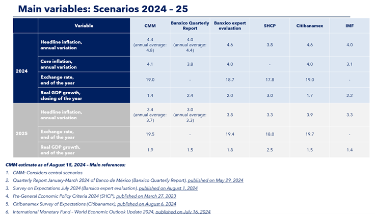

    
# Consensus Forecast: Mexico's Economic Outlook

Summary of Consolidated Forecast

Based on perspectives from relevant agencies that produce or compile expert expectations, we present the following forecast for key macroeconomic indicators for Mexico in the coming years. The Mexican economy has demonstrated remarkable resilience post-pandemic, exceeding the expectations of many analysts. Despite economic activity not yet returning to 2018 per capita levels, the three percent growth in 2022 surpassed projections. Analysts who had overestimated and extrapolated the slowdown in late 2021 were proven incorrect, as the deceleration was transitory. Moreover, the robustness of exports and rising consumer income have continued to support economic activity. 

This analysis incorporates projections from the CMM and other relevant agencies that produce or compile expert expectations to present a comprehensive forecast for key macroeconomic indicators in the coming years.

## Table 1 – Scenarios on the performance of the most relevant macroeconomic variables by CMM and other agencies, 2024 and 2025

